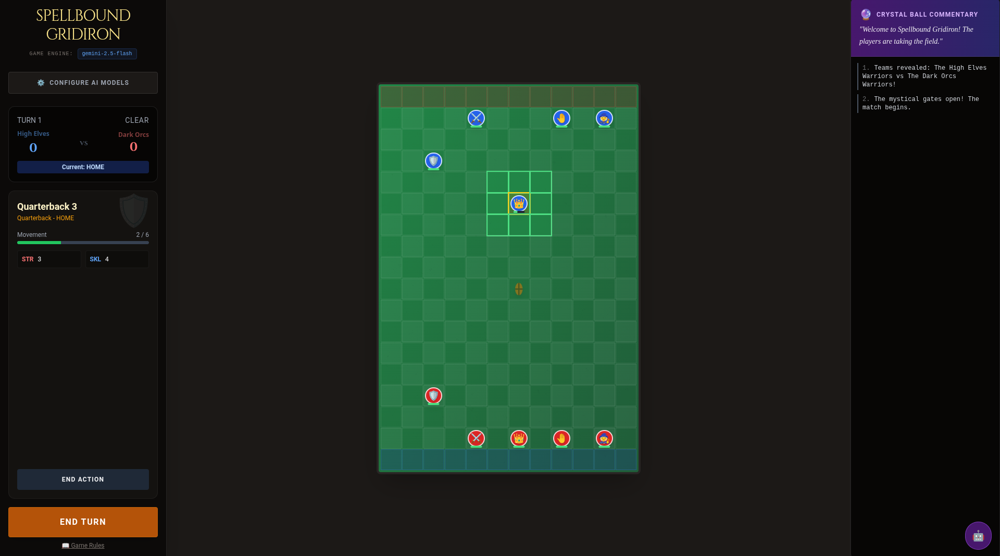

# Spellbound Gridiron

A fantasy football strategy game powered by AI. Broadly inspired by Blood Bowl: two teams of five (Linemen, Blitzers, Catchers, a Quarterback, and a spell-slinging Wizard) battle across a 12x18 grid, tackling, passing, and casting spells to carry the ball into the opposing endzone.

The AI angle is a dual-engine setup: one LLM provides live match commentary and team names, while a second powers an in-game assistant chatbot (Coach "Iron-Gut" Ironfist) for rules help and tactical advice. Both engines can run on cloud APIs (OpenAI, Gemini, Claude) or on local CLI tools via a small backend server.



## YouTube Videos

- [Getting started!](https://www.youtube.com/watch?v=pgtWZjtKIuA&t=1s) : a quick tour of the game and how to set it up.

## Run Locally

**Prerequisites:**  Node.js

1.  **Install dependencies:**
    ```bash
    npm install
    cd server && npm install && cd ..
    ```

2.  **Environment Setup:**
    - Create a `.env` file in the root directory (see `.env.example` or `.env.local`).
    - Add your `GEMINI_API_KEY` for in-game commentary.
    - (Optional) Add `OPENAI_API_KEY`, `ANTHROPIC_API_KEY`, etc. if strictly using server-side keys (though the UI now allows client-side entry).

3.  **Start the Backend (CLI Runner):**
    The backend is required for using local CLI tools (like `codex` or `claude` CLI).
    ```bash
    npm run start:server
    ```

4.  **Start the Frontend:**
    In a new terminal:
    ```bash
    npm run dev
    ```

## 📖 Gameplay Manual

### The Basics
Spellbound Gridiron is a turn-based tactical sports game played on a 12x18 grid. The objective is to score touchdowns by moving the ball into the opponent's endzone.

### Player Roles & Stats

Each player has unique stats that define their capabilities:

-   **Lineman**: Tough and reliable. High Armor.
-   **Blitzer**: The muscle. Balanced Speed and Strength.
-   **Catcher**: Fast and agile (Move 8), but fragile (Armor 7).
-   **Quarterback**: The playmaker. Good passing skills.
-   **Wizard**: Special unit capable of casting spells like *Fireball* or *Teleport*.

### Terrain & Weather

Pick the pitch and the sky on the start screen; both have real mechanical effects, telegraphed on the board and in the rulebook.

**Terrain** (affects movement):

-   **Elven Fields (Grass)**: Standard footing, no effect.
-   **Orc Pits (Mud)**: Every step risks a slip. A failed step drops the unit prone (Stunned) where it lands and shakes the ball loose.
-   **Demon Forge (Lava)**: A set of glowing hazard tiles is seeded at kickoff (shown with a ⚠️). Step onto one and the molten ground knocks the unit down.
-   **Frozen Wastes (Ice)**: A step slides one extra tile in the same direction whenever that tile is open.

**Weather** (affects passing and events):

-   **Clear**: No penalty.
-   **Rain**: Wet ball; passes are +1 harder.
-   **Blizzard**: Driving snow; passes are +2 harder and every player suffers -1 Move (one fewer square per turn, minimum 1).
-   **Meteor Shower**: A meteor tile is telegraphed one full round (shown with a ☄️), then strikes it, knocking down anyone standing there and jarring the ball loose. Clear the tile before it lands.

### Progression (XP & Levels)

Players grow across a match. Every play banks XP, and enough XP levels a unit up (to a maximum of level 5), granting one small stat bump capped to that role's strengths. The selected unit's card shows its current **level** and **accrued XP**.

-   **XP awards**: landing a tackle **+2**, completing a pass **+2**, casting a spell **+1**, scoring a touchdown **+5**.
-   **Level thresholds** (cumulative XP): Level 2 at 5, Level 3 at 12, Level 4 at 21, Level 5 at 32.
-   Progression is saved and restored with the match (the save format is versioned; saves from older versions are rejected rather than loaded).

### Persistent Rosters & Rematch

Teams persist between matches. When a match ends, both rosters (every player's XP, level and earned stat bumps) are written to versioned, named localStorage slots, separately from the single-match Save/Load slot. The post-game screen then offers two choices:

-   **Rematch**: replays with the same two teams, reusing the saved rosters, so your veterans return at their formation slots carrying the XP and levels they earned. Corrupt or missing roster data falls back gracefully to fresh teams.
-   **New Game**: starts over with brand-new teams (progression reset).

## Features

### 🤖 AI Assistant (chatbot)
Click the robot icon to open the **Ai Assistant** terminal. This assistant provides in-game help, rule clarifications, and tactical advice.

### ⚙️ Game Configuration
Click the **Gear Icon** to open the Settings Modal. Here you can configure the dual-engine architecture:

1.  **Game Engine**: Powers automatic commentary, team names, and flavor text.
2.  **Assistant Engine**: Powers the interactive chat assistant.

**Supported Providers:**
-   **Cloud APIs**: OpenAI (ChatGPT), Gemini (Google), Claude (Anthropic). _(Requires API Keys)_
-   **CLI Tools**: Local execution of `codex`, `claude`, or `gemini` command-line tools via the backend server.
